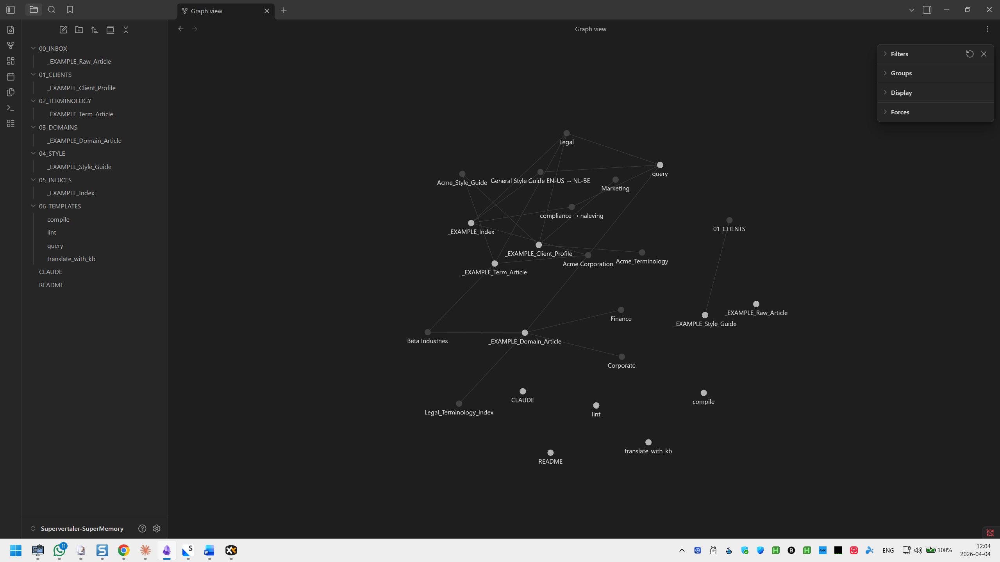

# SuperMemory


SuperMemory is an upcoming feature currently in early development. This page describes the intended functionality.


SuperMemory is a self-organizing translation knowledge base that replaces traditional translation memories and term bases with a living, AI-maintained wiki. Instead of rigid fuzzy matching, SuperMemory gives the AI full contextual understanding of your clients, terminology decisions, domain conventions, and style preferences.

<figure><figcaption>SuperMemory knowledge graph showing interconnected clients, terminology, and domain knowledge</figcaption></figure>

## How it works

SuperMemory is built on [Obsidian](https://obsidian.md/) and stores all knowledge as interlinked Markdown files — human-readable, portable, and future-proof.

The workflow has three phases:

### 1. Ingest

Drop raw material into the inbox: client briefs, style guides, glossaries, feedback notes, reference articles, or previous translations. SuperMemory accepts anything that helps you translate better.

### 2. Compile

The AI reads your raw material and writes structured knowledge base articles:

* **Client profiles** — language preferences, terminology decisions, style rules, project history
* **Terminology articles** — approved translations with rejected alternatives and the reasoning behind each choice
* **Domain knowledge** — conventions, common pitfalls, and reference material for specific fields (legal, medical, technical, marketing)
* **Style guides** — formatting rules, register, localisation conventions

Every article is interlinked with backlinks, so you can navigate from a client to their preferred terms to the domain those terms belong to.

### 3. Maintain

SuperMemory periodically scans itself for inconsistencies: conflicting terminology, broken links, stale content, missing cross-references. It heals itself — like a librarian who keeps the shelves organised.

## Why SuperMemory?

| Traditional TM/TB | SuperMemory |
|---|---|
| Fuzzy matching on surface text | Contextual understanding of _why_ terms were chosen |
| Static — requires manual updates | Self-healing — AI maintains and interlinks |
| Opaque — hard to audit decisions | Every decision traceable to a readable `.md` file |
| Locked to one tool | Portable Markdown — works with any editor |
| Segments in isolation | Connected knowledge graph |

## Folder structure

SuperMemory organises knowledge into six folders:

| Folder | Contents |
|---|---|
| `00_INBOX` | Raw material — drop zone for unprocessed content |
| `01_CLIENTS` | Client profiles and preferences |
| `02_TERMINOLOGY` | Term articles with translations, alternatives, and reasoning |
| `03_DOMAINS` | Domain-specific conventions and pitfalls |
| `04_STYLE` | Style guides and formatting rules |
| `05_INDICES` | Auto-generated indexes and maps of content |

## Getting started

SuperMemory ships as a vault skeleton in your [user data folder](data-folder.md):

```
C:\Users\{you}\Supervertaler\supermemory\
```

1. Open this folder as a vault in [Obsidian](https://obsidian.md/)
2. Drop raw material (client briefs, glossaries, feedback) into `00_INBOX`
3. Run the compilation agent to process your inbox into structured articles
4. Watch your knowledge graph grow as connections form between clients, terms, and domains

## Integration with Supervertaler

When translating, the AI consults your SuperMemory knowledge base before producing a translation. It checks:

* The **client profile** for language preferences and style rules
* **Terminology articles** for approved translations (and knows which alternatives to avoid)
* **Domain knowledge** for conventions and common pitfalls
* **Style guides** for formatting and register

This means every translation is informed by your accumulated project knowledge — not just pattern matching, but real understanding.

## Learn more

SuperMemory is inspired by Andrej Karpathy's [LLM Knowledge Base](https://venturebeat.com/data/karpathy-shares-llm-knowledge-base-architecture-that-bypasses-rag-with-an) architecture. The source code and vault templates are available on [GitHub](https://github.com/michaelbeijer/Supervertaler-SuperMemory).
